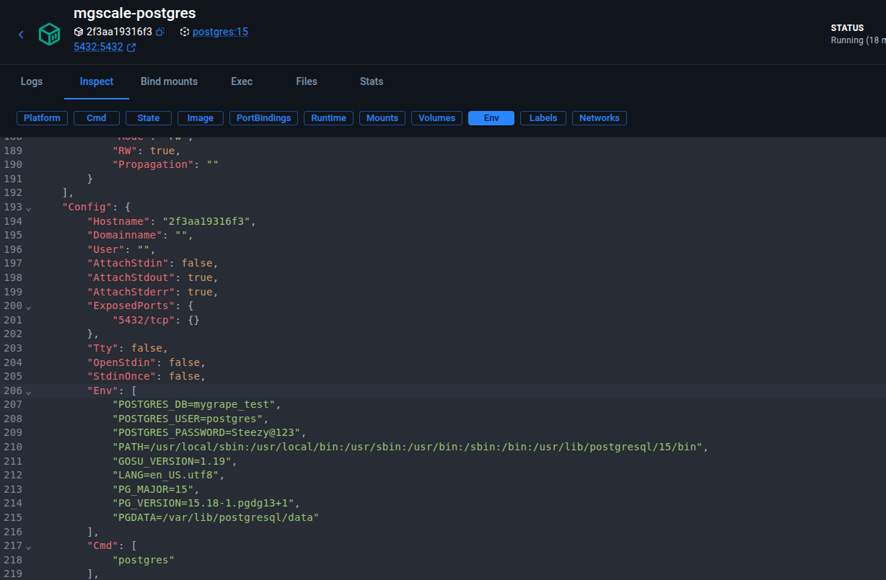

# Vyrona Pytest Test Suite Documentation

This documentation provides future contributors with a comprehensive guide on the prerequisites, setup instructions, execution steps, and functional coverage of the pytest test suite for the Vyrona backend.

---

## 📋 Table of Contents
1. [Prerequisites](#-prerequisites)
2. [Environment Setup](#-environment-setup)
3. [Running Tests](#-running-tests)
4. [Test Files Functional Overview](#-test-files-functional-overview)
   - [Authentication Tests (`test_auth.py`)](#1-authentication-tests-test_authpy)
   - [Profile & Support Tests (`test_profile.py`)](#2-profile--support-tests-test_profilepy)
   - [Activity Logging Tests (`test_activity_log.py`)](#3-activity-logging-tests-test_activity_logpy)
   - [Cryotank Telemetry Integration (`test_alert_ingestion.py`)](#4-cryotank-telemetry-integration-test_alert_ingestionpy)
   - [Feedback SMTP Integration (`test_feedback_integration.py`)](#5-feedback-smtp-integration-test_feedback_integrationpy)
   - [IVF Dashboard Consistency (`test_dashboard_consistency.py`)](#6-ivf-dashboard-consistency-test_dashboard_consistencypy)
   - [Report Dashboard Scenarios (`report_dash.py`)](#7-report-dashboard-scenarios-report_dashpy)
   - [Refrigerator Telemetry Integration (`test_refrigerator_alert_ingestion.py`)](#8-refrigerator-telemetry-integration-test_refrigerator_alert_ingestionpy)
   - [KPI Config Validation (`test_alert.py`)](#9-kpi-config-validation-test_alertpy)

---

## 🛠 Prerequisites

To run the backend test suite locally, you need the following tools installed on your system:

- **Python (v3.12 or compatible)**
- **Poetry (v2.4.1 or compatible)** for dependency and package management
- **Docker & Docker Compose** for managing external service dependencies

---

## ⚙ Environment Setup & Database Initialization

To run tests, you must configure your environment variables and initialize a separate test database (`mygrape_test`). Follow the instructions below based on your setup:

### 1. Configure the Environment File (`backend/.env`)

From the `backend/` directory, copy the test environment configuration template:
```bash
cp .env.test .env
```
*(Alternatively, copy `.env.example` to `.env` and manually adjust the settings)*:
- `DB_NAME=mygrape_test` (Ensure this is set to `mygrape_test` to prevent tests from wiping your development database!)
- `DB_PASSWORD=your_db_password_here`
- `ENVIRONMENT=testing`

---

### 2. Create the Test Database (`mygrape_test`)

Choose the scenario that matches your database configuration:

#### Scenario A: Database Running via Docker Compose (Default Setup)
By default, Docker Compose initializes only the database specified in your root `.env` (typically `mygrape` for development). The test database is **not** automatically created.
1. Start your services if they aren't already running:
   ```bash
   docker compose up -d postgres redis azurite eventhub-emulator smtp4dev backend telemetry-service iot-ingestion-service

   docker compose up -d (alternative command)
   ```
2. Manually create the test database inside the running Postgres container:
   ```bash
   docker exec -it mgscale-postgres psql -U postgres -c "CREATE DATABASE mygrape_test;"
   ```

> [!IMPORTANT]
> **Database Alignment for Live Integration Tests:**
> Some integration tests (e.g. `test_alert_ingestion.py` and `test_refrigerator_alert_ingestion.py`) trigger webhooks that run inside your host Docker containers. For these tests to pass, your Docker containers and your test suite must point to the **same** database.
> 1. Set `POSTGRES_DB=mygrape_test` in your **root** `.env` (in the project root directory).

> 2. Restart your host containers:
>    ```bash
>    docker compose down && docker compose up -d
>    ```
 make sure the password and DB here in env shows the same as given in backend/.env.test file

> 3. After testing, remember to revert your root `.env` to `POSTGRES_DB=mygrape` and run `docker compose up -d` to resume normal development.

#### Scenario B: Local Native or External/Cloud Database (Non-Docker Postgres)
If you are running a native Postgres installation directly on your local system or using an external cloud database (e.g. Neon, AWS RDS):
1. **Create the test database:** 
   - For a local native installation, run:
     ```bash
     psql -U postgres -c "CREATE DATABASE mygrape_test;"
     ```
   - For a cloud service, manually create `mygrape_test` using your cloud console or a database management tool (like pgAdmin or DBeaver).
2. **Start the auxiliary Docker services:**
   Even though you are not using Postgres inside Docker, you **must** still run the other auxiliary services (like Azurite, Event Hub Emulator, and Telemetry Service) in Docker for integration tests:
   ```bash
   docker compose up -d redis azurite eventhub-emulator smtp4dev telemetry-service iot-ingestion-service
   ```
3. **Align database settings in environment files:**
   Since your integration webhooks run inside the telemetry-service Docker container, the container must be able to reach your non-Docker database. You must match the database credentials in the **root `.env`** (passed to the telemetry containers) with **`backend/.env.test`** (used by the local test runner).
   - **For Cloud Databases:** Use the cloud provider's host URL (e.g., `ep-xyz.neon.tech`).
   - **For Local Native Databases:** Containers cannot resolve `localhost` to the host machine. You must set `DB_HOST` in your environment files to your host machine's IP address (e.g., `172.17.0.1` on Linux, or `host.docker.internal` on macOS/Windows) so the containers can connect to your host's Postgres database.

#### Scenario C: Running Pytest *Inside* the Backend Container
If you prefer to run tests inside the Docker container itself instead of on your host machine:
1. Update `DB_HOST` in `backend/.env` to **`postgres`** (since container-to-container communication uses the Docker service name):
   ```env
   DB_HOST=postgres
   ```
2. Run the test suite using `docker compose exec`:
   ```bash
   docker compose exec backend poetry run pytest <file path>
   ```

---

### 3. Create Tables & Seed Data

Once the database is created, run the following commands from the `backend/` directory to create the schemas and seed default test data:
```bash
poetry run python -c "from app.config.database import init_db; init_db()"
poetry run python -c "from app.init_db import init_db; init_db()"
```

---

## 🚀 Running Tests

All commands must be executed from the `backend/` directory.

### Run All Tests
```bash
poetry run pytest
```

### Run a Specific Test File
```bash
poetry run pytest tests/app/auth/test_auth.py
```

### Run Multiple Specific Test Files
```bash
poetry run pytest tests/app/auth/test_auth.py tests/app/profile/test_profile.py
```

### Run Tests by Marker (e.g. Integration Tests Only)
```bash
poetry run pytest -m integration
```

### Exclude Integration Tests (Run Unit Tests Only)
```bash
poetry run pytest -m "not integration"
```

---

## 🔍 Test Files Functional Overview

This section covers the core scenarios, verification mechanisms, and functional purposes of each test module.

### 1. Authentication Tests (`test_auth.py`)
- **Path:** `backend/tests/app/auth/test_auth.py`
- **Functional Overview:** Validates registration, user onboarding, OTP triggers, and account security.
- **Key Scenarios Covered:**
  - **Registration Validation:** Validates required fields, password strength, and duplicate email rejections.
  - **Login Failures & Lockout:** Asserts that after 5 consecutive failed login attempts, the user account is temporarily locked.
  - **OTP Verification Flow:** Tests valid OTP approvals, incorrect OTP inputs, resend cooldown thresholds, and OTP expiration lifespans.
  - **Single-Use Invite Links:** Ensures generated hospital/branch invitation links can only be consumed once.
  - **Input Sanitization:** Evaluates API resilience against SQL injection or XSS strings (e.g. `<script>`, `UNION SELECT`) inside input email addresses.

### 2. Profile & Support Tests (`test_profile.py`)
- **Path:** `backend/tests/app/profile/test_profile.py`
- **Functional Overview:** Verifies profile updates, security middleware, and helpdesk support ticketing.
- **Key Scenarios Covered:**
  - **Profile Details Updates:** Asserts proper saving of name modifications and checks that phone numbers comply with validation bounds (e.g. character/digit limits).
  - **Security Middleware Protections:** Submits SQL Injection, XSS, and shell Command Injection payloads into the profile update fields, ensuring that the sanitization middleware catches and neutralizes malicious inputs.
  - **Support Tickets & Feedback:** Verifies ticket creation (with or without attachments), comment threads addition, ticket resolution status changes, and list querying.

### 3. Activity Logging Tests (`test_activity_log.py`)
- **Path:** `backend/tests/app/activity_log/test_activity_log.py`
- **Functional Overview:** Validates that an immutable audit trail is generated for key business events.
- **Key Scenarios Covered:**
  - **Authentication Logs:** Confirms logs are created for `user.login_requested`, `email.otp_sent`, `user.login`, `user.logout`, and `email.password_reset_sent`.
  - **Onboarding & Approval Logs:** Captures events when a new user registers or when an admin approves/rejects an application.
  - **Admin Action Bypass:** Confirms that operations performed under the `Mygrape_admin` system account bypass normal user-activity logging to avoid cluttering hospital-specific audit logs.
  - **Alert Escalations & Acknowledgements:** Ensures events like `email.escalation_sent` and `alert.acknowledged` are cleanly logged in the activity trail.

### 4. Cryotank Telemetry Integration (`test_alert_ingestion.py`)
- **Path:** `backend/tests/app/integration/test_alert_ingestion.py`
- **Functional Overview:** End-to-end integration test validating the cryotank telemetry and threshold notification pipeline.
- **Key Scenarios Covered:**
  - **Environment Setup:** Provisions mock structures for Hospital, Branch, Tank (e.g. `94`, `95`), and Device ID mappings.
  - **Raw IoT Ingestion:** Validates ingestion endpoints for CUSTOM_IOT weight telemetry and Tive IVF temperature webhook structures.
  - **Breach Notification:** Submits out-of-bounds metrics (e.g. temperature spikes) and polls local `smtp4dev` to verify that alert notification emails are dispatched.
  - **Cooldown Suppression:** Asserts that consecutive alerts within the configured cooldown window are suppressed and do not trigger duplicate notification emails.

### 5. Feedback SMTP Integration (`test_feedback_integration.py`)
- **Path:** `backend/tests/app/integration/test_feedback_integration.py`
- **Functional Overview:** End-to-end SMTP mail workflow verification for support tickets.
- **Key Scenarios Covered:**
  - **Ticket Creation Notifications:** Verifies that when a feedback ticket (with PDF/image attachments) is submitted, a confirmation email lands in `smtp4dev` for both the submitter and the platform administrator.
  - **Comment & Status Updates:** Tests that status changes (e.g., to "In Progress") and comment threads postings dispatch matching update emails.
  - **Email Toggle Checks:** Ensures that if the `send_email` flag is disabled in the request payload, notification emails are not sent.

### 6. IVF Dashboard Consistency (`test_dashboard_consistency.py`)
- **Path:** `backend/tests/app/dashboard/test_dashboard_consistency.py`
- **Functional Overview:** Asserts UI state sync, monthly metrics consistency, and role-based data partitioning.
- **Key Scenarios Covered:**
  - **Monthly Roll-overs:** Pushes fake timestamps to check that quality deviations are partitioned properly by month (e.g., May vs. April) and that labels adjust accordingly.
  - **All-Time Volumetric Data:** Confirms all-time statistics (e.g. total containers, total cryolocks) remain unchanged across monthly roll-over boundaries.
  - **Badge vs. Active Deviations Sync:** Asserts that the dashboard's active alert badge increment on new alerts and decrement immediately upon alert acknowledgement.
  - **RBAC Scopes:** Verifies that IVF `User` role queries only fetch data scoped to their specific branch, while `Admin` or `Manager` roles retrieve aggregated values hospital-wide.

### 7. Report Dashboard Scenarios (`report_dash.py`)
- **Path:** `backend/tests/app/dashboard/report_dash.py`
- **Functional Overview:** Tests monthly summary report compiling and report-export endpoint validation.
- **Key Scenarios Covered:**
  - **Month Filtering:** Confirms that requesting a report for a specific month (e.g., `2026-05`) fetches deviations and alerts only belonging to that period.
  - **Request Parameter Validation:** Ensures invalid month parameter formats (e.g., `05-2026`) are rejected with `400 Bad Request`.
  - **Download Validation:** Verifies the download initialization endpoints require a valid `report_type` parameter, returning `422 Unprocessable Entity` if empty.

### 8. Refrigerator Telemetry Integration (`test_refrigerator_alert_ingestion.py`)
- **Path:** `backend/tests/app/integration/test_refrigerator_alert_ingestion.py`
- **Functional Overview:** Validates the live end-to-end pipeline for refrigerator zone temperature and humidity alerts.
- **Key Scenarios Covered:**
  - **Flat Telemetry Processing:** Processes flat Tive telemetry payloads (e.g. `DeviceTemperature`) mapped to refrigerator zones.
  - **Critical Alert Actions:** Verifies that out-of-range temperature telemetry triggers critical alerts and emails branch users.
  - **Escalation Notification:** Verifies that if critical alerts remain unacknowledged and exceed thresholds, escalation emails are dispatched to the branch Admin.
  - **Soft Alerts vs. No Alerts:** Confirms that configurations set to `'soft'` only save low-severity logs (no emails), and `'no_alert'` configurations keep the reading status as non-deviating.
  - **Disabled Configs:** Asserts that status-disabled configs (status = `false`) log readings with `deviation = True` but suppress alert creation.

### 9. KPI Config Validation (`test_alert.py`)
- **Path:** `backend/tests/app/alert-config/test_alert.py`
- **Functional Overview:** Asserts that the configurations parameters submitted for various KPIs conform to logical and type constraints.
- **Key Scenarios Covered:**
  - **External / Internal Temperature:** Enforces that both `min` and `max` must be provided, and that `min` must be less than or equal to `max`.
  - **LN2 Level:** Enforces a min-only parameter configuration that rejects negative values.
  - **Battery Level:** Restricts values between 0% and 100%, and requires `max` to be non-zero.
  - **Cross-KPI Rules:** Asserts that equal values (`min == max`) are accepted, whereas symbols (`@#$%`) and non-numeric inputs in numerical limit fields are rejected with a `400` status.
